# **Traffic Sign Recognition** 

## Writeup Ulrich Voll


**Build a Traffic Sign Recognition Project**

The goals / steps of this project are the following:
* Load the data set (see below for links to the project data set)
* Explore, summarize and visualize the data set
* Design, train and test a model architecture
* Use the model to make predictions on new images
* Analyze the softmax probabilities of the new images
* Summarize the results with a written report

cf. [rubric points](https://review.udacity.com/#!/rubrics/481/view) 


[//]: # (Image References)

[image1]: ./data_statistics.png "Visualization"
[image2]: ./gray_vs_colour.png "Grayscaling"
[image3]: ./examples/random_noise.jpg "Random Noise"
[image4]: ./verkehrszeichen/tempo30.jpg "Traffic Sign 1"
[image5]: ./verkehrszeichen/rechts_vorbei.jpg "Traffic Sign 2"
[image6]: ./verkehrszeichen/stop.jpg "Traffic Sign 3"
[image7]: ./verkehrszeichen/tempo70.jpg "Traffic Sign 4"
[image8]: ./verkehrszeichen/ueberholverbot.jpg "Traffic Sign 5"
[image9]: ./verkehrszeichen/einfahrt_verboten.jpg "Traffic Sign 6"
[image10]: ./verkehrszeichen/vorfahrt_achten.jpg "Traffic Sign 7"
[image11]: ./verkehrszeichen/vorfahrtstrasse.jpg "Traffic Sign 8"
[image12]: ./verkehrszeichen/3p5m.jpg "Traffic Sign 9"


### Executive Summary


As a starting point, I used my leNet implementation from the lecture/quizz, as suggested. 

This initial implementation did not work well out of the box, and I observed severe overfitting. Symptoms: Near 100% accuracy on the training set but far less (~ 60%, initially) on the validation set. 

I then came up with two major improvements:
* Regularisation (both L_2 and dropout, details see below). Still overfitting but better (80% training accuracy). 
* Conversion to greyscale, following your hints. Surprisingly (to me), this massively improved the validation-set-accuracy well beyond the limit of 93%.

More specifically, after some tuning (all details see below) I acchieved 96% accuracy on the validation set.

The solution found also performs well on the test set (some 95%).

I did not have to use any form of data augmentation to get this relatively pleasing result. 

However, the implementation at that stage performed unsatisfactory on my real world test images of German traffic signs (55% accuracy on 9 images, moreover near 100% softmax probabilities on the wrong indices, i.e. false positive detection).

Thereafter I decided to augment/pad the training dataset such that every class was represented at least 1000 times, by simply appending the respective classes of initally underrepresented images sufficiently often to the training set. 

I did not apply any (random) distortions to the dataset itself, but decided to apply such distortions (random noise, random rotations) in TF at-run-time/on-the-fly, using functions like tf.contrib.image.rotate.

This preserved but did not substantially increase training and validations accuracies. However, the real world data were handled better, in that more pictures were correctly classified, plus softmax probabilities appear to be only close to 100% iff the image is correctly classified (ok, I was looking at only 9 images ...), and bounded away from a zero entropy distribution otherwise.  

I also played around with your function outputFeatureMap() for introspection into the network. 

See detailed report and discussions below. 

Here is a link to my [project code](https://github.com/uv10000/P3/blob/master/Tr
affic_Sign_Classifier.ipynb), next to it in the github-repo P3 there is a .html export of the .jpynb showing the simulation results, alongside with this writeup-file. 

I worked in a local setup using my GTX 1070 under Ubuntu 16.04 employing the GPU Version of the udacity carnd-term1 conda environment, Tensorflow 1.3 (did not dare to update after discovering this outdated version number).

### Data Set Summary & Exploration

#### 1. Provide a basic summary of the data set. In the code, the analysis should be done using python, numpy and/or pandas methods rather than hardcoding results manually.

I used numpy/python to calculate summary statistics of the traffic
signs data set:

* The size of training set is 34799 (using .shape) 1 
* The size of the validation set is 4410 (using .shape) 
* The size of test set is 12630 (using .shape) 
* The shape of a traffic sign image is (32, 32) (using .shape) 
* The number of unique classes/labels in the data set is 43 (using np.max on the y-values)

 After augmentation/padding (see below) we have 64468 images in the training set. 

#### 2. Include an exploratory visualization of the dataset.

Here are three bar charts showing the (absolute) frequencies of the data as a function  of label,  for all three sets, ie training, validation and test set.

<p align="center">
  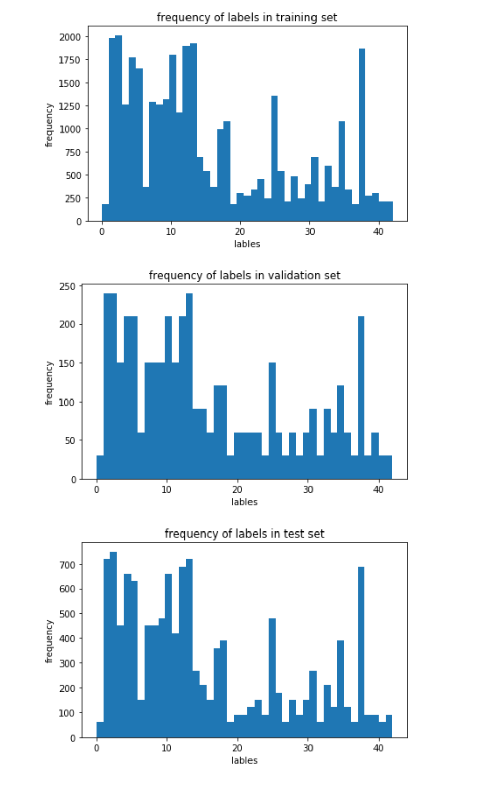
</p>

The distribution seems to be fairly similar for training validation and test set, which is a good thing (at least valildation and test set should follow the same distribution). 

Classes are indeed distributed quite unevenly and data augmentation as suggested might well be worth a try.  


In the .ipynb this "padding" can be turned on optionally. See below for details on padding. 


### Design and Test a Model Architecture

#### 1. Describe how you preprocessed the image data. What techniques were chosen and why did you choose these techniques? Consider including images showing the output of each preprocessing technique. Pre-processing refers to techniques such as converting to grayscale, normalization, etc. (OPTIONAL: As described in the "Stand Out Suggestions" part of the rubric, if you generated additional data for training, describe why you decided to generate additional data, how you generated the data, and provide example images of the additional data. Then describe the characteristics of the augmented training set like number of images in the set, number of images for each class, etc.)

Initially, I merely normalized the (RGB-)image data according to your suggestion. The approximate formula (pixel - 128)/ 128 is indeed good enough. 

Only later, after getting stuck in an overfitting situation with the colour-images,  I decided to convert the images to grayscale because Udacity suggested it. This turned out to help a lot, but I am not sure why, see discussion below. 

Here is an example of a traffic sign image before and after my grayscaling, using "cv2.cvtColor" in a straightforward way.


![alt text][image2]

1 
Only in the end I decided to apply padding/augmentation.

```python
ny=np.zeros(n_classes)
    for cl  in range(n_classes):
        ny[cl] = np.sum(y_train==cl)
        while ny[cl] <1000:
            indexset=(y_train==cl)
            #print(indexset)
            #X_new=X_train[indexset,:,:,:]
            #print(X_new.shape)
            X_train = np.concatenate([X_train,X_train[indexset,:,:,:]],axis=0)
            y_train = np.concatenate([y_train,y_train[indexset]],axis=0)
            ny[cl] = np.sum(y_train==cl)   
    print(ny)
```

After augmentation/padding we have 64468 images in the training set. 


Here come the histograms for the "padded" version where each class is represented by at least 1000 images (simply repeated copies of the existing images, to be randomized on-the-fly only later in TF) 
<p align="center">
  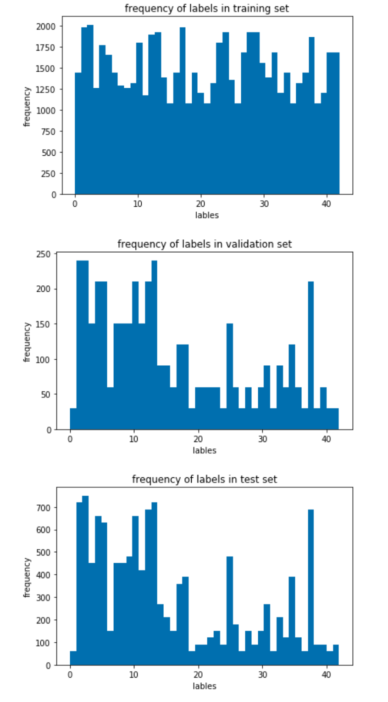
</p>
1 


#### 2. Describe what your final model architecture looks like including model type, layers, layer sizes, connectivity, etc.) Consider including a diagram and/or table describing the final model.

My final model consisted of the following layers:

| Layer         		    |     Description	        					            | TF variable name
|:---------------------:|:---------------------------------------------:| :------------------: |
| Input         		    | 32x32x1 greyscale image   							      |                      |
| Convolution 5x5     	| 1x1 stride, valid padding, outputs 28x28x6 	  |                      |
| RELU					        |												                        | ac1                  |
| Max pooling	      	  | 2x2 stride, same padding,  outputs 14x14x6 		| ap1                  |
| Convolution 5x5     	| 1x1 stride, valid padding, outputs 10x10x16 	|                      |
| RELU					        |												                        | ac2                  |
| Max pooling	      	  | 2x2 stride, same padding, outputs 5x5x16 			| ap2                  |
| Flatten        		    | 5x5x16 outputs 400        									  |                      |
| Fully connected		    | outputs 120        									          |                      |
| RELU					        |	                        											|                      |
| Dropout               |                                               | fc1                  |
| Fully connected		    | outputs 84         									          |                      |
| RELU 			            |				                        								|                      | 
| Dropout               |                                               | fc2                  |
| Fully connected		    | outputs 43         									          | fc3                  |
| Softmax				        | (no RELU nor Max Pooling nor Dropout here)    |                      |

 


#### 3. Describe how you trained your model. The discussion can include the type of optimizer, the batch size, number of epochs and any hyperparameters such as learning rate.

To train the model, I used
* Adam Optimizer as in class, learing rate 0.002
* cost function "cross entropy" as in class
* L2 Normalisation, weight factor mylambda = 0.25
* Dropout Normalisations in some layers (details see above) with keep_prob=50% dropout during training. 
* 50 Epochs 
* BATCH_SIZE = 256 
* local Nvidia GTX 1070 under Ubuntu 16.04, udacity conda env for GPU
* weights initialised with mean = 0.0 and sigma = 0.1, truncated normal, sizes see architecture overview above
* biases initialised with 0.0s
* RELU as non-linearity
* learned parameters are stored to disk using the tl.saver mechanism  
* randomisation see code snippet right below (random translations omitted due to old TF 1.3 on my machine)
```
# apply random rotations "on the fly", i.e. on-line
anglevector=tf.random_normal(
    [batch_size],
    mean=0.0,
    stddev=3.0 *3.14/180) # +/- 3° noise
x=tf.contrib.image.rotate(x,anglevector) #rotate x by random vactors
# end of random rotations
# add random noise  "on the fly", i.e. on-line
noise=tf.random_normal(
    tf.shape(x),
    mean=0.0,
    stddev=0.1) # range of pixel values is approx [-1,1]
x=x+noise
# end of add random noise
### # the following is omitted due to TF v1.3 on my machine not supporting tf.contrib.image.translate
#### add random translations  "on the fly", i.e. on-line
###translations=tf.random_normal(
###    [batch_size,im_size,im_size],
###    mean=0.0,
###    stddev=3) # translate +/- 3 pixel-widths
###x=tf.contrib.image.translate(x,translations)
####translations: A vector representi```ng [dx, dy] or (if images has rank 4) a matrix of length num_images,
####with a [dx, dy] vector for each image in the batch.
#### end of add translations
```


#### 4. Describe the approach taken for finding a solution and getting the validation set accuracy to be at least 0.93. Include in the discussion the results on the training, validation and test sets and where in the code these were calculated. Your approach may have been an iterative process, in which case, outline the steps you took to get to the final solution and why you chose those steps. Perhaps your solution involved an already well known implementation or architecture. In this case, discuss why you think the architecture is suitable for the current problem.

My final model results were:
* training set accuracy of 99.9%
* validation set accuracy of 96.4% 
* test set accuracy of 95.0%

* I started off with the architecture from the leNet class/quizz (initially adapted to three colour channels, later returned to greyscale). 
* Problems with the initial architecture: Severe overfitting, that is very good training accuracy but poor validation accuracy.
* How was the architecture adjusted and why was it adjusted? Introduced regularization, validation accuracy increased to some 80% (from some 60% previously). 
*I used both L2-regularisation and dropout (details above). 
* Main improvement: Changing to greyscale Images. Validation accuracy reached values around 96%. I do not have a theoretical justification, I tried it since it was suggested by udacity and it worked. 
* Which parameters were tuned? I tuned both the learning rate and the weight for regularization. Dropout prob 50% worked fine.  
* What are some of the important design choices and why were they chosen? The leNet architecture was a good choice, quite capable of describing the data without overfitting, provided proper regularisation is implemented.
* How does the final model's accuracy on the training, validation and test set provide evidence that the model is working well? Training accuracy close to one and still high validation accuracy. 
* I was unhappy with the way the real world images were handled and I decided to include data augmentation only in the very end, see below. 

### Test a Model on New Images 

#### 1. Choose some German traffic signs found on the web and provide them in the report. For each image, discuss what quality or qualities might be difficult to classify.

Here are nine German traffic signs that I found on the web, or photographed myself (since I live in Munich ...):


<p align="center">
   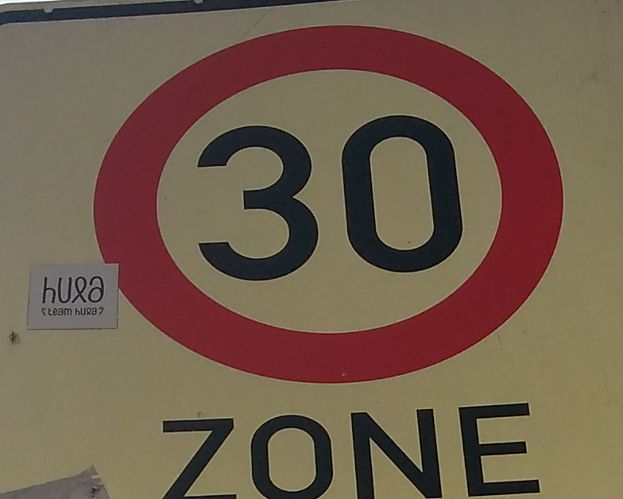
   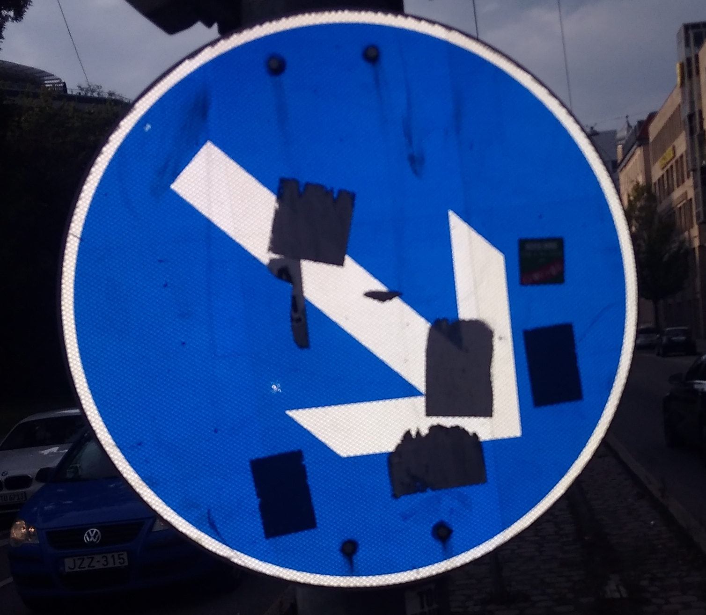
   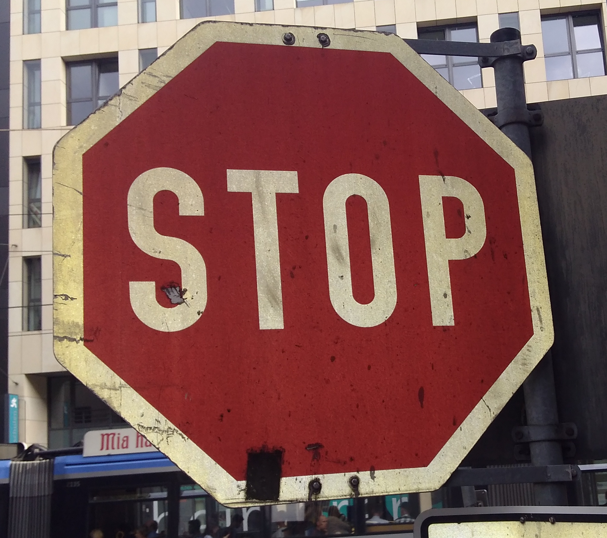
</p>

<p align="center">
   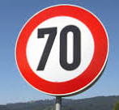
   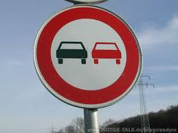
   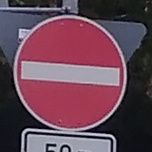
</p>

<p align="center">
   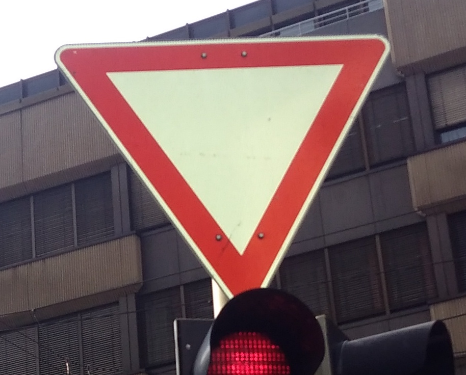
   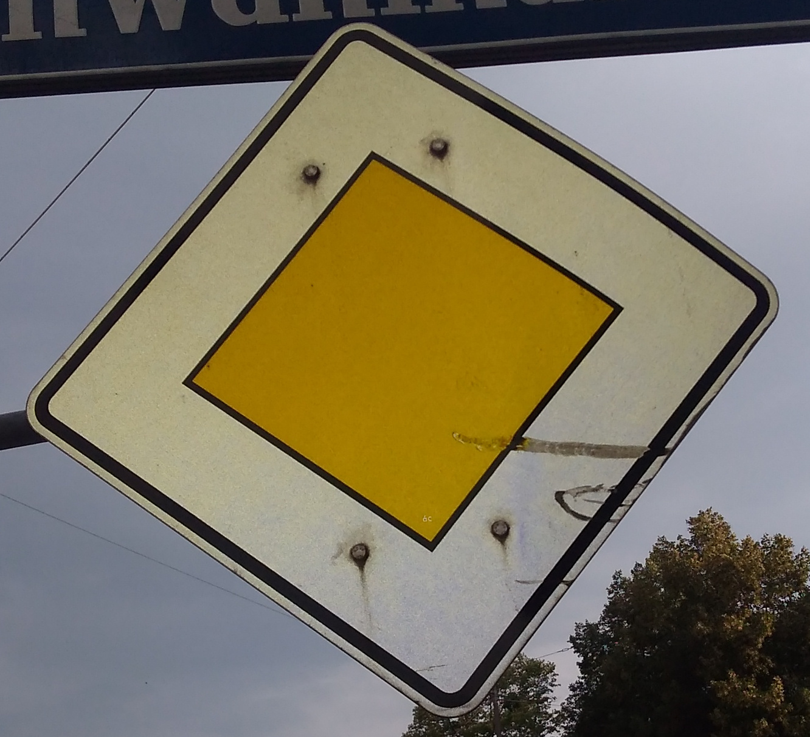
   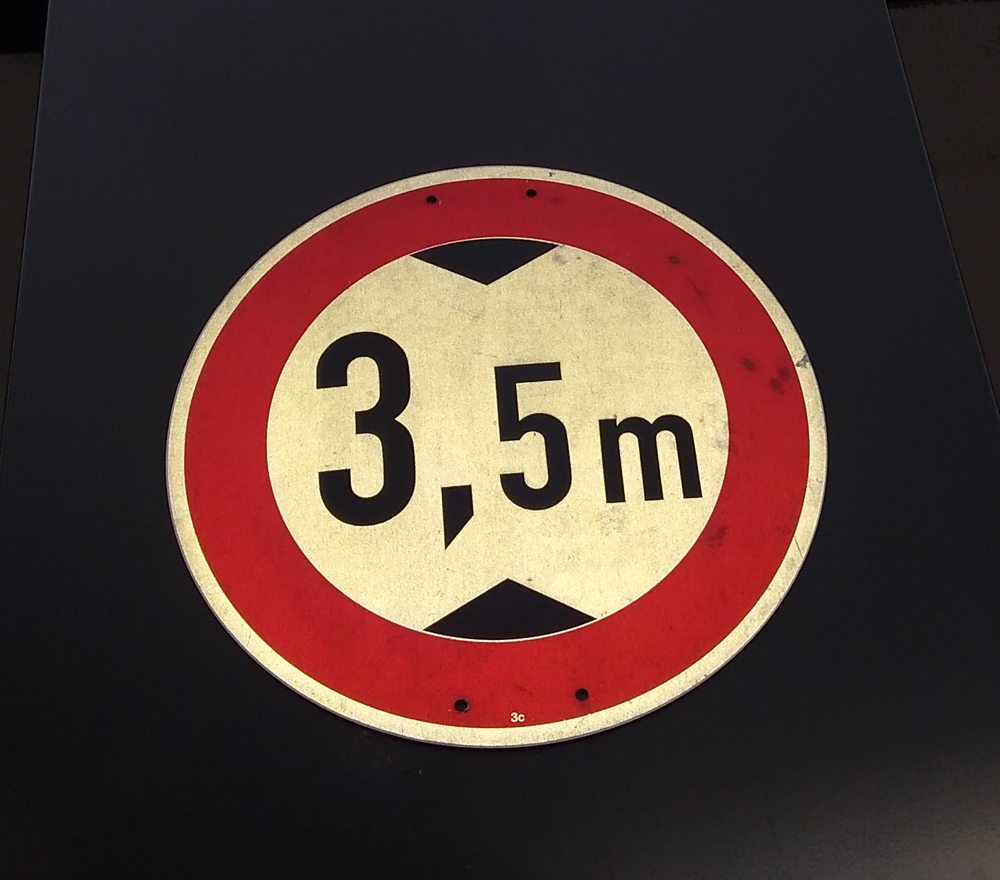
</p>


All images are nicely centred and cropped.

The last image is "off the record", it is a German traffic sign but not in the list (max height 3.5m).

Here are the same images converted to 32x32 greyscale
<p align="center">
   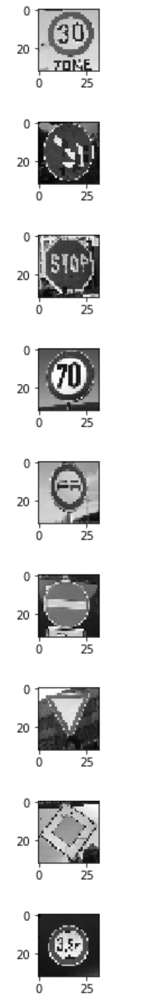
</p>

#### 2. Discuss the model's predictions on these new traffic signs and compare the results to predicting on the test set. At a minimum, discuss what the predictions were, the accuracy on these new predictions, and compare the accuracy to the accuracy on the test set (OPTIONAL: Discuss the results in more detail as described in the "Stand Out Suggestions" part of the rubric).

Here are the results of the predictions on the first 8 real world image (the 9th is a sign not in the list ...):

| Image			        |     Prediction  				| T/F |softmax-probability
|:--------------------:|:--------------:|:----|:------------------:| 
| 1 30 km/h            	| 9 no passing  | F   | 84%                |
| 38  Keep right        | 38 	 								 | T   | 99%                |
| 14	 Stop              | 14											 | T   | 100%               |
| 4 70 km/h             | 11 Right-of-way| F   | 72%                |
| 9	No passing          | 4 70 km/						| F   | 98%                |
| 17 No entry           | 17     							| T   | 100%               |
| 13	Yield              | 13     							| T   | 100%               |
| 12	Stop	              | 12     							| T   | 100%               |
|                       |               |     |                    |
|                       |               |62.5%|                    |
|                       |               |     |                    |
| not in list (max height 3.5m)|  9    no passing | n.a.         | 93%|

The model was able to correctly guess 4 of the 5 traffic signs, which gives an accuracy of 80%. This compares favorably to the accuracy on the test set of ...

#### 3. Describe how certain the model is when predicting on each of the five new images by looking at the softmax probabilities for each prediction. Provide the top 5 softmax probabilities for each image along with the sign type of each probability. (OPTIONAL: as described in the "Stand Out Sugge stions" part of the rubric, visualizations can also be provided such as bar charts)

The code for making predictions on my final model is located in the 11th cell of the Ipython notebook.

For the first image, the model is relatively sure that this is a stop sign (probability of 0.6), and the image does contain a stop sign. The top five soft max probabilities were

| Probability         	|     Prediction	        					| 
|:---------------------:|:---------------------------------------------:| 
| .60         			| Stop sign   									| 
| .20     				| U-turn 										|
| .05					| Yield											|
| .04	      			| Bumpy Road					 				|
| .01				    | Slippery Road      							|


For the second image ... 

### (Optional) Visualizing the Neural Network (See Step 4 of the Ipython notebook for more details)
#### 1. Discuss the visual output of your trained network's feature maps. What characteristics did the neural network use to make classifications?


